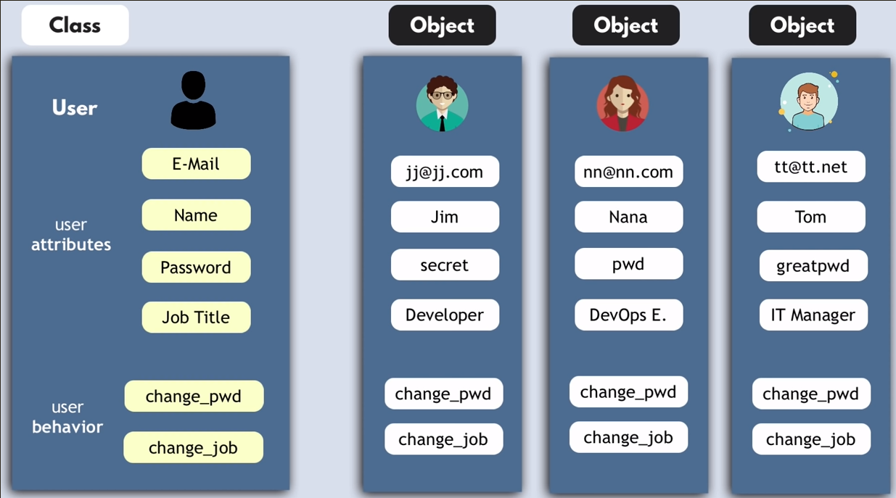

# Опорний конспект Python3 для початківців(v3.0)


> Python  — це  інтерпретована мова програмування високого рівня загального призначення. Філософія її дизайну наголошує на  читабельності коду з використанням значних відступів.

## ЗМІННІ

> Змінні (ідентифікатори) у Python – це імена, визначені користувачем.

**Правила створення:**

* Не можна використовувати зарезервовані ключові слова як назву ідентифікатора.
* Ідентифікатор Python може містити літери в малому регістрі (az), великі (AZ), цифри (0-9) і підкреслення (_).
* Імена ідентифікаторів не можуть починатися з цифри. 
* Ідентифікатор Python не може містити лише цифри.
* Ім'я ідентифікатора Python може починатися з підкреслення.
* Довжина імені ідентифікатора не обмежена.
* Імена ідентифікаторів Python чутливі до регістру. 

### Оголошення та видалення змінних

```py
myNumber = 3   #myNumber->3
name = "John" 
del name
```

---

## ТИПИ ДАНИХ

```py
str, int, float, bool, complex, NoneType
```
* Незмінні (Immutable): int, float, string, tuple
* Змінні (Mutable): list, dict, object, set

### Перетворення типів
```py
int() float() bin() str() bool() list() dict() set() tuple()
```

### Перевірка типу та розміщення даних
```py
print(type(a))		  #<class 'int'>
isinstance(a, int)	#True/False
print(id(a))        #129383443221312
```

> Оголошення змінних та структур з візуалізацією: [(https://pythontutor.com)](https://pythontutor.com/)

---

## ОПЕРАТОРИ

### Математичні
```py
+  -   *   /  // %  **
```

### Присвоювання
```
=  +=  -=  *=  /=  
```

### Логічні
```py
<	>	<= 	>= 	!= 	 == 
```

### Службові слова складних умов
```py
and or not in is
```

### Додаткові можливості

**Використання матем.функцій**
```py
import math
x = math.sqrt(a)
```
**Випадкові числа**
```py
from random import *
n = randint(1,10)
```

---

## КОМЕНТАРІ
```py
# однорядковий коментар

'''
багаторядковий 
коментар
'''
```
---


## ВВЕДЕННЯ ДАНИХ
```py
word = input()
num = int(input())
word1,word2 = input().split()
num1,num2 = map(int,input().split())
```


## ВИВЕДЕННЯ ДАНИХ
```py
print(b)
print(a1,a2)
print(a,b,sep = "-")  #виведення із роздільником
print(a,b,end = " ")  #виведення із закінченням
print("Hello"*3)      #реплікація (повторне виведення)
```

### Форматований вивід 
```py
#f-string
first_name = "ada"
last_name = "lovelace"
print(f"{first_name} {last_name}")

#r-string
print(r"c:\user\tasks\new")

#.format()
first_name = "ada"
last_name = "lovelace"
print("The first programmer was {0} {1}".format(first_name,last_name))

#float format output
price = 196.3587
print(“{:.2f}”.format(price))
print(f"{price:.2f}")
```

---

## РОЗГАЛУЖЕННЯ if

```py
if x > 0 and x < 5:
   print(x)
elif x>= 5:
   print(x*x)
else:
   print(“error”)
```

### Тернарний оператор
```py
max = a if a > b else b 
```

---

## ЦИКЛИ 

### Цикл з параметром for
```py
s = 0
for i in range(1,10,1):
   s = s + i
print(s)
```

### Цикл з передумовою while
```py
s = 0
i = 1
while i <= 10:
   s = s + i
   i = i + 1
print(s)
```

### Додаткові команди для циклів break/continue 
```py
for val in "string":
    if val == "i":
        break     #вихід з циклу
    print(val)

print("The end")
------
Output:
s
t
r
The end
```

```py
for val in "string":
    if val == "i":
        continue    #перезапуск ітерації
    print(val)

print("The end")
------
Output:
s
t
r
n
g
The end
```


--- 


## РЯДКИ

```py
st = input()

#використання операторів
print('Hello' + ' world')
print('Hello ' * 5)
print('w' in st)
```

### Методи рядків
```py
name  =  "ada lovelace"
print(name.upper())		#ADA LOVELACE
print(name.lower())		#ada lovelace
print(name.title())		#Ada Lovelace

#інші

.isnumeric
.isalpha
.rstrip()
.lstrip()
.strip()

wd = s.split()        #розділення
'-' .join(sl)         #злиття з роздільником
s.find('red')         #пошук входження (-1, немає)
s.replace('yes','no')
```

### Зрізи
```py
print(st[3:9])
print(st[3:9:2])
```


---


## СПИСОК (list)
```py
#введення та ініціалізація списку
textList = list(input().split())
numList = list(map(int,input().split()))

mas = [1, 5, 7, 9]
mas = ["John", "Bob", "Dan"]

numbers = list(range(1,10))

#генераторні списки
squares = [element**2 for element in range(1,11)]

#доступ до елементу
print(mas[0])  
```

### Перебір списку
```py
#поелементно
for element in mas:
	print(element)

#за індексами
for i in range (0,n):
	print(mas[i])
```

### Функції роботи зі списками
```py
sumList = sum(mas)         
minElement = min(mas)
maxElement = max(mas)        
lengthList = len(mas)
```

### Методи списків
```py
mas.sort()				#mas.sort(reverse = True)
mas.remove(element)
mas.reverse()
mas.clean()
mas.append(element)
mas.extend(mas2)
mas.index(element)
mas.insert(position,element)
mas.pop(position)
mas.count(element)
```

### Зрізи списку (слайси)
```py
print(mas[2:4])
print(mas[:3])
copymas = mas[:]
```


---


## КОРТЕЖ (tuple) 
```py
#незмінний список
a = (10, 2.13, “square”, 89, ‘C’)
b = tuple(b)
(a1,a2,a3,a4,a5)  =  a 	#розпаковка
```


---


## ФУНКЦІЇ

### Глобальні та локальні змінні

* Будь-яка змінна всередині функції є локальною.

* Для звернення до глобальних змінних у функції використовують слово **global**

* Приорітет областей видимості встановлюється за правилом: **LEGB** (Local, Enclosing, Global, Built-in).


### Описи і виклики функцій з відомою кількістю аргументів
```py
RESULT = 0                        #глобальна змінна
def sum_num(a,b=0):               #функція з звичайним і параметром по-замовчуванню
  '''Опис (docstring)'''
	return a+b

x,y = int(input())
RESULT = sum_num(x,y)             #виклик функції з позиційними аргументами
RESULT = sum_num(a = x, b = y)    #виклик функції з іменованими аргументами
print(RESULT)
```


### Описи і виклики функцій з невідомою кількістю аргументів

```py
def calc(operation, *args):       #упаковка в кортеж n позиційних аргументів
	result = 0
    for argument in args:
		if operation == "+":
			result += argument
    return result

print (calc("+", 1,2,3,4))
```

```py
def in_dict(**kwargs):			#упаковка в словник n іменованих аргументів 
    print(kwargs)

in_dict(cat = 'кіт', dog = 'собака')
```


### Анотації до функцій (опис очік.типів)
```py
def some_func(a:int, b:str) -> float:
     print(a,b)
     return (3.5)
```


### Анонімні функції (lambda)
```py
g = lambda x,y,z:x+(y*z)
print(g(1,2,3))
```

### Вбудовані функції

* для роботи з символами – ord(), chr(), len()

* математичні – abs(), round(), divmod(), pow(), max(), min(), sum()


---


## МОДУЛІ ТА ПАКЕТИ

**Модуль** - це файл, що містить визначення та оператори мови Python. 

**Ім'я модуля** - це ім'я файлу з додаванням суфікса **.py**. 

Усередині модуля ім'я модуля (як рядок) доступне, як значення глобальної змінної **\_\_name\_\_**. Однак, якщо модуль виконується в середовищі коду верхнього рівня (**python some_module.py**), його **\_\_name\_\_** встановлюється в рядок **\_\_main\_\_**.


### Імпорт модулю

```py
import math
from math import *              #імпорт усього модулю	
from math import sqrt           #вибір ф-цій 
from math import sqrt as sq     #імпорт з псевдонімом
dir(math)                       #перелік функцій у модулі
```

```py
# main.py
print("Always executed")

if __name__ == "__main__":
    print("Executed when invoked directly")
else:
    print("Executed when imported")


---
$ python main.py
Always executed
Executed when invoked directly

Import module
>>> import main
Always executed
Executed when imported
```


---


**Пакет** - це каталог (папка) в якій знаходиться файл __init__.py. Використовується, як засіб для групування та впорядкування великої кількості власних модулів.

### Структура проекту у вигляді пакету

```bash
zoo-example
├── animals
│   ├──handlers
│   │  ├── __init__.py
│   │  ├── walk.py
│   │  └── swim.py
│   ├── __init__.py
│   ├── crocodile.py
│   ├── monkey.py
│   └── zoo.py
├── README.md
└── setup.py
```

```py
from animals import crocodile
from animals.monkey import Monkey
from animals.handlers import swim
from animals.handlers.walk import is_walking
```

**setup.py - сценарій для встановлення проекту, як пакету**
```py
from setuptools import setup, find_packages
setup(
    # name of package
    name="zoo-example", 
    # packages (directories) to be included
    packages=find_packages(),
    # script entry point
    entry_points={
        "console_scripts": [
            "zoo = animals.zoo:main",
        ],
    },
    # package dependencies
    install_requires=[
        "termcolor==1.1.0",
    ],
    version="0.1",
    author="Captain Jack",
    author_email="captain_jack@gmail.com",
    description="Example of the test application",
    license="MIT")
```


## Засіб керування пакетами - PIP

### Команди роботи з пакетами

```bash
#Install package
$ pip install <package_name>

#Install local package
$ pip install /home/user/zoo-example

#Upgrade already installed package
$ pip install --upgrade <package_name>

#Install package of particular version
$ pip install <package_name>=='version_num'

#Install version that satisfy a critirea
$ pip install <package_name> >= 'version_num'

#Upgrading pip
$ pip install -U pip

#Search package
$ pip search "query"

```


### Використання pip (pyqt5 example)

```bash
pip3 install pyqt5 pyqt5-tools pyqt5-sip

pip3 list

pip3 freeze

pip3 freeze > requirements.txt

pip3 install -r requirements.txt


pip3 install --upgrade pip setuptools wheel
pip3 install --upgrade PyQt5 PyQt5-Qt5 PyQt5-sip
```


#### Convert .ui to .py

```bash
sudo apt install pyqt5-dev-tools
pyuic5 -x login.ui -o loginUI.py
```


---


## СЛОВНИК (dict) 

```py
vocabulary = {	
		'cat': 'кіт', 
		'dog': 'собака', 
		'bird': 'птах'
	}

print(vocabulary['cat'])              #друк за ключем
vocabulary['elephant']  =  'бегемот'  #додавання
print(vocabulary)                     #друк словника
del vocabulary['cat']                 #видалення за ключем
searched_word = vocabulary.get('lion','No searched word')
```

### Методи словників
```py
vocabulary.get()
vocabulary.keys()
vocabulary.values()
vocabulary.items()
vocabulary.setdefault(...)
vocabulary.clear()
vocabulary.pop()
vocabulary.popitem()
vocabulary1.update(vocabulary2)
vocabulary = dict.fromkeys(['one', 'two', 3])   #{'one': None, 'two': None, 3: None}
```

**Приклад 1:**
```py
# Anti-pattern
d = {}

if "node" not in d:
    d["node"] = []

d["node"].append("item")

# Best practice
d = {}
d.setdefault("node", []).append("item") #встановлення значення по-замовчуванню
```

**Приклад 2:**
```py
>>> dict2 = dict.fromkeys(['one', 'two', 3], 10)
>>> dict2
{'one': 10, 'two': 10, 3: 10}
```


### Використання функцій зі словниками
```py
sorted(vocabulary.items()) #впорядкування по ключу
```


### Опрацювання словників
```py
#перебір циклом пар ключ-значення
for key,value in vocabulary.items():	
	print(f"\n Key:{key}")
	print(f" Value:{value}")

#пошук за ключем
if 'dog' not in vocabulary.keys():		
	print('No key in dict')
```

```py
#підрахунок повторень слів у текстовому файлі з допомогою словника
name = input("Enter file name...")
file_object = open(name)

counts = dict()
for line in file_object:
  words = line.split()
  for word in words:
    counts[word] = counts.get(word,0) + 1

#пошук слова, що найчастіше зустрічається
bigcount = None
bigword = None
for word, count in counts.items():
  if bigcount is None or count > bigcount:
    bigword = word
    bigcount = count

print(bigword, bigcount)
```


```py
#10
fhand = open('romeo.txt')
counts = {}
for line in fhand:
  words = line.split()
  for word in words:
    counts[word] = counts.get(word, 0 ) + 1

lst = []
for key, val in counts.items():
  newtup = (val, key)
  lst.append(newtup)

lst = sorted(lst, reverse=True)

for val, key in lst[:10]: 
  print(key, val)
```


---


## РОБОТА З ФАЙЛАМИ 

### ЗЧИТУВАННЯ

Читання рядка з числом
```py
file_object = open("input.txt","r")  # r - read, w - write, a - append,  r+ - read/write
a = file_object.readline()
a = int(a)
file_object.close()
```

Читання всього файлу (з автоматичним закриттям with)
```py
with open("input.txt") as file_object:
  content = file_object.read()

print(content.rstrip())
```


Читання всього файлу порядково (списком рядків)
```py
with open("input.txt") as file_object:
  lines = file_object.readlines()

for line in lines:
  print(line.rstrip())
```


Читання файлу порядково з конструкцією перевірки імені файлу (див. Вийнятки)
```py
file_name = input('Enter the file name: ')
try:
  file_object = open(file_name)
except:
  print('File cannot be opened:', file_name)
  quit()

for line in file_object:
    print(line.rstrip())
```


### ЗАПИС

Простий запис змінної з числом
```py
file_object = open("output.txt","w") # r - read, w - write, a - append,  r+ - read/write
x = str(x)
file_object.write(x)
file_object.close()
```


Запис рядка у порожній файл
```py
with open("output.txt", "w") as file_object:
  file_object.write("Hello, world! \n")
```


### Робота з файлами та каталогами

```py
import os
# Rename a file from test1.txt to test2.txt
os.rename( "test1.txt", "test2.txt")

# Delete file test2.txt
os.remove("text2.txt")

# print current path
print(os.getcwd())

# change current dir to /tmp
os.chdir("/tmp")

# create new directory
os.mkdir("app_dir")

# delete directory
os.rmdir("app_dir")

```


### ЗБЕРІГАННЯ ТА ПАРСИНГ ДАНИХ (JSON)

```py
import json
d = json.loads(input('Input dict:'))
print(d)
```

```bash
Input dict:{"language": "Python", "version": 3.11}
>>{'language': 'Python', 'version': 3.11}
```


```py
import json
numbers = [2, 3, 5, 7, 11, 13]
filename = "numbers.json"

with open(filename, "w") as f:
  json.dump(numbers, f)         #вивантаження даних

with open(filename, "r") as f:
  numbers = json.load(f)        #завантаження даних

print(numbers)

```


---


## ВИЙНЯТКИ (exeptions)


### ZeroDivisionError

```py
a = int(input("a="))
b = int(input("b="))
try:
  result = a / b
except ZeroDivisionError:
  print("You can't divide by 0!")
else:
  print(result)
```

### ValueError (NameError, TypeError)

```py
#Перевірка на число
count = input()
try:
   count = int(count)
except ValueError: 
   print("Not digit")
else:
  print(type(count))
```

### FileNotFoundError

```py
filename = "input.txt"
try:
  with open(filename, encoding="utf-8") as f:
    content = f.read()
except FileNotFoundError:
  print(f"File {filename} does not exist!")
else:
  ...
```


## МНОЖИНА (set)

Множина - це незмінна, невпорядкована колекція унікальних елементів, яка може складатися з цілих чисел, чисел з плаваючою комою, рядків і кортежів. Однак, множини не можуть містити змінні елементи, такі як списки, множини або словники.

### Базові операції
```py
x = {1, 2, 3, 1, 2}
y = {2, 4, 5}

print("x:", x)

print("x & y:", x & y) # x.intersection(y)
print("x | y:", x | y) # x.union(y)
print("x - y:", x - y) # x.difference(y)
print("x ^ y:", x ^ y) # x.symmetric_difference()
```

```py
set1 = {"John", "Bob", 22, 26}

lst = ["Jenny", 26, "Parker", "Parker", 10.5]
set2 = set(lst)				#перетворення списку в множину

students = {"Jane", "Carlos", "Amy", "Bridgette", "Chau"}
print("Chau" in students)	#перевірка наявності елементу в множині True/False
```

### Методи роботи з множинами

```py
students1 = {"Jane", "Carlos", "Amy", "Bridgette", "Chau"}
students2 = {"Alice", "Lily", "Zhuo", "Amy", "Jane"}
 
students1.update(students2)		#додавання до множини іншої множини, кортежу, списку чи словника

set1.add(<element>)
set1.remove(<element>)        #видалення (видає помилку, якщо не існує елемент)
set1.discard(<element>)       #видалення (НЕ видає помилку, якщо не існує елемент)
set1.pop()                    #видалення спочатку

set1.issubset(y)              #True/False

set1.union(y)                 #(x|y)об’єднання
set1.intersection(y)          #(x&y)переріз
set1.difference(y)            #(x-y)різниця
set1.symmetric_difference(y)  #(x^y)симетрична різниця
```


---


## Об'єктно-орієнтоване програмування (ООП)

### Поняття класу

Типові структури даних, такі як числа, рядки та списки, призначені для збереження простих фрагментів інформації. 

**Класи** використовуються для створення складних користувацьких структур даних. Також класи містять функції, які називаються **методами**, що визначають поведінку та дії, які об'єкт, створений з класу, може виконувати зі своїми даними.



### Принципи ООП

#### Абстракція (Abstraction) - виділення найістотніших характеристик об'єкта, що відрізняє його від інших

```py
class Person:						#назва класу (PascalCase)
	def __init__(self, name, age):	#конструктор класу
    """Class documentation string"""
		#ініціалізація атрибутів
		self.name = name
		self.age = age
	
	def get_name(self):				#методи клас (self - вказівник для екземплярів)
		return self.name
	
	def get_age(self):
		return self.age

	def __del__(self):				#деструктор
		pass

person1 = Person (name = "John", age = 34)		#створення екземпляру
print(person1.name, person1.age)
print(person1.get_name(), person1.get_age())	#виклик методів
del person1

```
**Зміна атрибутів**
```py
person1.age = 7   #визначення атрибуту
person1.age = 8   #зміна атрибуту
del emp1.age      #видалення значення атрибуту
```
**Функції для роботи з атрибутами**
```py
# Returns true if 'age' attribute exists
hasattr(person1, 'age')

# Returns value of 'age' attribute
getattr(person1, 'age')

# Set attribute 'age' at 8
setattr(person1, 'age', 8)

# Delete attribute 'age'
delattr(person1, 'age')
```


#### Поліморфізм (Polymorphism) - коли об'єкти різних класів з різною реалізацією, мають однакові інтерфейси

```py
class Checking():
   def type(self):
       print('You have a checking account at the Codecademy Bank.')
 
   def balance(self):
       print('$20 left in your checking.')
 
class Savings():
   def type(self):
       print('You have a savings account at the Codecademy Bank.')
 
   def balance(self):
       print('$1000 left in your savings.')


account_a = Checking()
account_b = Savings()
 
for account in (account_a, account_b):
   account.type()
   account.balance()

```

#### Інкапсуляція (Encapsulation) - приховування даних атрибутів від впливів напряму 
 Модифікатори:
 - публічні - доступні ззовні (name)
 - захищені - не наслідуються (_phoneNumber)
 - приватні - недоступні напряму(__creditCard)
 Модифікатори працюють і для методів.


#### Успадкування (Inheritance) - передача властивостей і методів батьківських (базових) класів з можливістю зміни

```py
class Base1:
    def fun(self):
        print("base1.fun")

class Base2():
    def jump(self):
        print("base2.jump")

class Child(Base1, Base2):
    def fun(self):
        print("child.fun")
        super().fun()

c = Child()
c.fun()   # child.fun base1.fun
c.jump()  # base2.jump
```


**Приклад реалізації:**
```py
class Person:
    def __init__(self, firstName, lastName, age):
        self.firstName = firstName
        self.lastName = lastName
        self.age = age
        
    def get_Person_info(self):
        return f"Name: {self.firstName} {self.lastName}, Age: {self.age}"

class Student(Person):
    def __init__(self, firstName, lastName, age, phoneNumber, creditCard):
        #Person.__init__(self, firstName, lastName, age)
        super().__init__(firstName, lastName, age)
        self._phoneNumber = phoneNumber
        self.__creditCard = creditCard

    def get_Student_info(self):
        return f"Name: {self.firstName} {self.lastName}, Age: {self.age}, {self._phoneNumber}, {self.__creditCard} "

student1 = Student("John", "Doe", 18, "+380671234567", "4561 1236 7894 1230")
print(student1.get_Student_info())
print(student1._phoneNumber) # protected variable can be accessed
print(student1.__creditCard) # private variable cannot be accessed
```


### "Магічні" методи

Метод __str__() в мові Python використовується для представлення об'єкта у вигляді рядка. Цей метод є одним із методів, який називається "магічними методами" (або "dunder" методами), оскільки він має спеціальне ім'я, яке починається і закінчується на два символи "_".

Магічні методи не призначені для прямого виклику вами, але виклик відбувається внутрішньо з класу при виконанні певної дії. Наприклад, коли ви додаєте два числа за допомогою оператора **+**, внутрішньо буде викликано метод **\_\_add_\_\()**. Інший метод **\_\_str\_\_()** визначає рядок, який буде повернутий, коли об'єкт буде виведений за допомогою функції **print()** або коли використовується функція str(). Цей метод зазвичай використовується для того, щоб забезпечити зрозуміле представлення об'єкта для користувача або для збереження даних у текстовому форматі.


**Приклади реалізації:**
```py
class Point:
    def __init__(self, x, y):
        self.x = x
        self.y = y
    
    def __str__(self):
        return "({0}, {1})".format(self.x, self.y)
        
p = Point(3, 4)
print(p)

---
Output:
(3, 4)
```
```py
class Vector:
    def __init__(self, a, b):
        self.a = a
        self.b = b

    def __str__(self):
        return f'Vector ({self.a}, {self.b})'

    def __add__(self,other):
        return Vector(self.a + other.a, self.b + other.b)

v1 = Vector(2,10)
v2 = Vector(5,-2)
print(v1 + v2) # print calls __str__ method implicitly to convert Vector object to string

------
Output:
Vector (7, 8)
```

---


## Черга і стек
Розглянемо два типи структур даних: черги та стеки. Це структури даних, які можуть зберігати колекцію елементів. Вони не є вбудованими у Python, але можна використовувати вбудовані структури даних Python, такі як списки, для їх створення. Різниця між ними полягає в тому, що черга зберігає елементи у форматі "першим прийшов - першим пішов" (FIFO), тоді як стек зберігає елементи у форматі "останнім прийшов - першим пішов" (LIFO).

### Черга

```py
class Queue:
 def __init__(self):
   self.head = None
   self.tail = None
   self.size = 0
 
 def enqueue(self, value):
   if self.has_space():
     item_to_add = Node(value)
     print("Adding " + str(item_to_add.get_value()) + " to the queue!")
     if self.is_empty():
       self.head = item_to_add
       self.tail = item_to_add
     else:
       self.tail.set_next_node(item_to_add)
       self.tail = item_to_add
     self.size += 1
   else:
     print("Sorry, no more room!")
 
 def dequeue(self):
   if self.get_size() > 0:
     item_to_remove = self.head
     print(str(item_to_remove.get_value()) + " is served!")
     if self.get_size() == 1:
       self.head = None
       self.tail = None
     else:
       self.head = self.head.get_next_node()
     self.size -= 1
     return item_to_remove.get_value()
   else:
     print("The queue is totally empty!")
  def peek(self):
   if self.size > 0:
     return self.head.get_value()
   else:
     print("No orders waiting!")
  def get_size(self):
   return self.size
 def is_empty(self):
   return self.size == 0
```

### Стек

```py
from node import Node
 
class Stack:
  def __init__(self, limit=1000):
    self.top_item = None
    self.size = 0
 
  def push(self, value):
    if self.has_space():
      item = Node(value)
      item.set_next_node(self.top_item)
      self.top_item = item
      self.size += 1
    else:
      print("All out of space!")
 
  def pop(self):
    if self.size > 0:
      item_to_remove = self.top_item
      self.top_item = item_to_remove.get_next_node()
      self.size -= 1
      return item_to_remove.get_value()
    else:
      print("This stack is totally empty.")
 
  def peek(self):
    if self.size > 0:
      return self.top_item.get_value()
    else:
      print("Nothing to see here!")
 
 
  def is_empty(self):
    return self.size == 0
```


## VIRTUAL ENVINRONMENTS


### venv
```bash
python3 -m venv ./venv
source venv/bin/activate

deactivate
```


### pyenv

#### Встановлення для Ubuntu 24.04

Джерело: [https://idroot.us/](https://idroot.us/install-pyenv-ubuntu-24-04/#google_vignette)

```bash
sudo apt update
sudo apt upgrade
sudo apt-get install -y make build-essential libssl-dev zlib1g-dev libbz2-dev libreadline-dev libsqlite3-dev wget curl llvm libncursesw5-dev xz-utils tk-dev libxml2-dev libxmlsec1-dev libffi-dev liblzma-dev

curl https://pyenv.run | bash

nano ~/.bashrc
----------------------------------
export PYENV_ROOT="$HOME/.pyenv"
export PATH="$PYENV_ROOT/bin:$PATH"
eval "$(pyenv init --path)"
eval "$(pyenv init -)"
eval "$(pyenv virtualenv-init -)"
-----------------------------------


nano ~/.profile
-----------------------------------
export PYENV_ROOT="$HOME/.pyenv"
[[ -d $PYENV_ROOT/bin ]] && export PATH="$PYENV_ROOT/bin:$PATH"
eval "$(pyenv init - bash)"
-----------------------------------


exec "$SHELL"

```

#### Використання pyenv
```bash
pyenv install --list            #список доступних версій python
pyenv versions                  #список встановлених версій python

pyenv install 3.8.10
pyenv global 3.8.10               
pyenv local 3.8.10

pyenv virtualenv myprojectenv   #створення virtual environment для версії python
pyenv local myprojectenv        #локалізація virtual environment
#або
pyenv virtualenv 3.9.6 myprojectenv #створення virtual environment для версії python


pyenv activate <venv_name>
pyenv deactivate
pyenv uninstall <venv_name>
```

---


## SCRIPTING

```python
#!/usr/bin/env python
print("Hello, Python!")

```


## Використані джерела

* Практикум програмування Python/C++ на eolymp.com

* Пришвидшений курс Python

* https://www.codecademy.com/learn/python-for-programmers

* TechWorld with Nana. Python Tutorial for Beginners (https://youtu.be/t8pPdKYpowI)

* Python Базовий (https://fundamenta.app/)

* Python: Структури даних. University of Michigan PDS101 (https://prometheus.org.ua/course/course-v1:Michigan+PDS101+2023_T3)

* Дистанційний курс: Cloud&DevOps Fundamentals Self-Paced Online Program від EPAM (https://campus.epam.ua/ua/training/3619)


